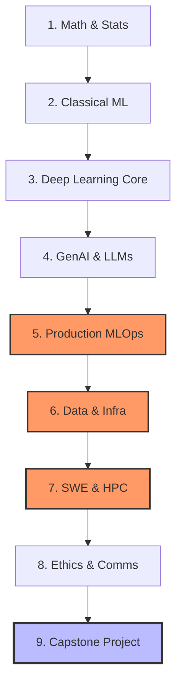

# 🚀 PhD to Job-Ready: ML & MLOps Engineer Roadmap

Welcome to my central learning hub and engineering portfolio. This repository documents my 6–12 month, project-driven transition from academic research to a production-focused Machine Learning / MLOps / LLMOps Engineer.

---

## 🗺️ High-Level Learning Roadmap

This portfolio covers 9 distinct execution modules culminating in an end-to-end production pipeline capstone. Modeling theory is treated leanly; systems, software engineering practices, performance tuning, and operational metrics dictate the pacing.



---

## 📅 Suggested Week-by-Week Timeline (6-Month Track)

| Weeks | Focus Module | Core Milestone Target |
| :--- | :--- | :--- |
| **1–2** | Module 1 (Lean) + Module 2 | Build Optimizer Zoo & Tabular Scikit-Learn Pipeline |
| **3–4** | Module 3 (Applied Fluency Only) | Complete Native PyTorch Transformer Fine-Tuning Loop |
| **5–7** | Module 4 (GenAI & LLMs) | Construct QLoRA Fine-Tuned + RAG Evaluation Harness |
| **8–12**| Module 5 (AI Engineering) — **Core Focus**| Deploy vLLM + FastAPI Gateways on Local Kubernetes |
| **13–15**| Module 6 (Data & Infra) | Set Up Orchestrated ETL Ingestion using DVC & Feast |
| **16–17**| Module 7 (SWE / HPC) | Harden Performance with pytest Codebases & JAX/Numba |
| **18–23**| Module 9 (**Capstone Execution**) | Ship the Productionized Research Intelligence Platform |
| **24** | Portfolio Polish & Interview Prep | Draft System Architecture Case-Studies & Resume Syncs |

> 💡 *For a 12-month track, double each time block and integrate a second, infra-focused side project (e.g., a Kubernetes-native multi-model serving system or a full Ray-based distributed training job) to expand the MLOps engineering scope.*

---

## 🗂️ General GitHub Portfolio Conventions

Every distinct project codebase nested within this ecosystem adheres strictly to the layout schema outlined below:

```text
project-name/
├── README.md               # Context, setup commands, numerical evaluations, and bottlenecks
├── src/                    # Reusable source code organized clean and modular by function
├── notebooks/              # Sandboxed scratchpads for raw exploratory research work only
├── tests/                  # Complete pytest testing suites guarding functional logic
├── configs/                # Isolated YAML/JSON application runtime parameter configurations
├── k8s/                    # Native Kubernetes infrastructure manifest configurations
├── docker/                 # High-efficiency Dockerfiles and multi-container Compose setups
├── .github/workflows/      # Automated CI pipelines: format checking, linting, & test runners
└── docs/                   # Visual architecture wireframes, system retrospectives, & charts
```

### 🎯 Strict Codebase README Requirements
Every nested module profile must answer the following questions directly, in chronological order:
1. **What problem does this solution solve?**
2. **How do I execute or interact with this platform in under 5 commands?**
3. **What were the concrete system performance results? (Must provide a numerical metric)**
4. **What exact design parameters would I optimize or improve next?**

---

## 🎯 Active Project Portfolio Summary

| Module | Core Project Target | Primary Stack | Priority | Status |
| :--- | :--- | :--- | :--- | :--- |
| **01** | **Optimizer Zoo** | NumPy, Matplotlib | 🟡 Nice-to-Have | ⏳ Planned |
| **02** | **End-to-End Tabular ML Pipeline** | Scikit-learn, Optuna | 🔴 Must-Have | ⏳ Planned |
| **03** | **Fine-Tune, Don't Derive** | PyTorch, W&B | 🔴 Must-Have | ⏳ Planned |
| **04** | **RAG Assistant + Eval Harness** | LlamaIndex, PEFT | 🔴 Must-Have | ⏳ Planned |
| **05** | **Serve, Scale, Monitor LLM** | vLLM, FastAPI, K8s, Evidently| 🔴 Must-Have | ⏳ Planned |
| **06** | **Versioned, Orchestrated Ingestion** | Prefect/Airflow, DVC, Feast | 🔴 Must-Have | ⏳ Planned |
| **07** | **Speed Up and Harden a Training Loop** | JAX/Numba, pytest, Streamlit| 🔴 Must-Have | ⏳ Planned |
| **08** | **Folded Ethics & Interpretability** | SHAP, Captum, Fairness 360 | 🔴 Must-Have | 🔄 Ongoing |
| **09** | **Research Intelligence Platform** | **Full MLOps Stack Unified** | 🔴🔴 Capstone | ⏳ Planned |

---

## 🛠️ Workspace Setup & Workflow Guide
1. **Task Boards:** View my active workflow pipeline on my [GitHub Projects Board](../../projects).
2. **Issue Generation:** When starting a new module, go to the **Issues** tab, click **New Issue**, and select the corresponding template.
3. **Commit Linking:** Include keywords in commit messages (e.g., `git commit -m "feat: complete numba optimization closes #7"`) to automatically track task completion.
