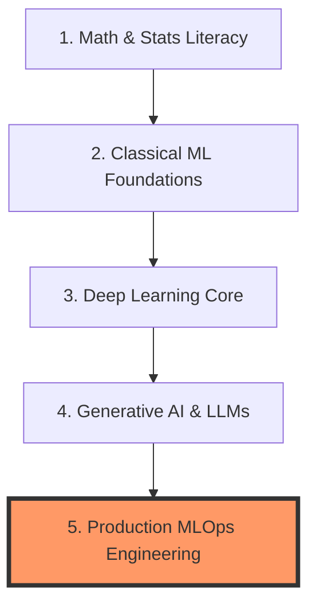

# 🚀 PhD to Job-Ready: ML & MLOps Engineer Roadmap

Welcome to my central learning hub and engineering portfolio. This repository documents my 6–12 month, project-driven transition from academic research to a production-focused Machine Learning / MLOps / LLMOps Engineer. 

Instead of focusing purely on theoretical derivations, this roadmap tracks my hands-on mastery of scalable model deployment, infrastructure reliability, automation pipelines, and production systems.

---

## 🗺️ High-Level Learning Roadmap

This portfolio is divided into 5 core execution modules. Each module contains deep theoretical notes, structured codebases, and production-grade portfolio projects.



---

## 🗂️ Repository Directory Structure

The workspace is organized into modular directories to keep study materials separate from deployed software engineering artifacts:

```text
.
├── .github/
│   └── ISSUE_TEMPLATE/        # Automated task templates for tracking milestones
├── 01-math-stats/              # Module 1: Linear algebra, calculus, & gradient descent
│   ├── notes.md                # Multi-variable chain rule & step-size mechanics
│   └── optimizer-zoo/          # NumPy code: Custom SGD, Momentum, RMSProp, & Adam
├── 02-classical-ml/            # Module 2: Feature engineering & deployment flywheels
│   ├── notes.md                # Data leakage prevention & operational tradeoffs
│   └── tabular-pipeline/       # Scikit-learn, Optuna, & automated Model Cards
├── 03-deep-learning/           # Module 3: Native PyTorch & Transformer internals
│   ├── notes.md                # Computational graphs & attention head dimensions
│   └── transformer-finetune/   # Raw PyTorch fine-tuning loop (No HF Trainer)
├── 04-genai-llms/              # Module 4: Applied GenAI & LLMOps
│   ├── notes.md                # RAG strategies, prompt hygiene, & Quantization
│   └── rag-eval-harness/       # Llama3/Mistral + QLoRA + Vector DB + Eval Harness
└── 05-production-mlops/        # Module 5: Infrastructure, Scale, & Reliability
    ├── notes.md                # Containers, API latency, & CI/CD architectures
    └── deployment-pipeline/    # Deployed FastAPI + Docker + K8s + MLflow + GitHub Actions
```

---

## 🎯 Active Project Portfolio Summary

| Module | Core Project Target | Primary Stack | Priority | Status |
| :--- | :--- | :--- | :--- | :--- |
| **01** | **Optimizer Zoo:** NumPy loss surface optimizations from scratch | NumPy, Matplotlib | 🟡 Nice-to-Have | ⏳ Planned |
| **02** | **End-to-End Tabular ML Pipeline:** Operational optimization tuning | Scikit-learn, Optuna | 🔴 Must-Have | ⏳ Planned |
| **03** | **Fine-Tune, Don't Derive:** Attention mapping & native training loops | PyTorch, Weights & Biases | 🔴 Must-Have | ⏳ Planned |
| **04** | **RAG Assistant + Eval Harness:** QLoRA finetunes validated on metrics | LlamaIndex/Weaviate, PEFT | 🔴 Must-Have | ⏳ Planned |
| **05** | **Production Pipeline:** High-throughput, fully monitored serving API | FastAPI, Docker, K8s, GHA | 🔴 Must-Have | ⏳ Planned |

---

## 🛠️ Automated Workspace Setup & Workflow Guide

To interact with this repository and stay on track, I leverage GitHub's native project management ecosystem:

1. **Task Boards:** View my active workflow pipeline on my [GitHub Projects Board](../../projects).
2. **Issue Generation:** When starting a new module, I go to the **Issues** tab, click **New Issue**, and select the corresponding Module template to instantly generate my learning goals and "Ship It" checklists.
3. **Commit Linking:** I include keywords in my commit messages (e.g., `git commit -m "feat: implement Adam logic closes #1"`) to automatically track task completion and transition project cards across columns.

---
*Follow along with my contribution graph as I turn raw data science theory into production-grade AI platforms.*
